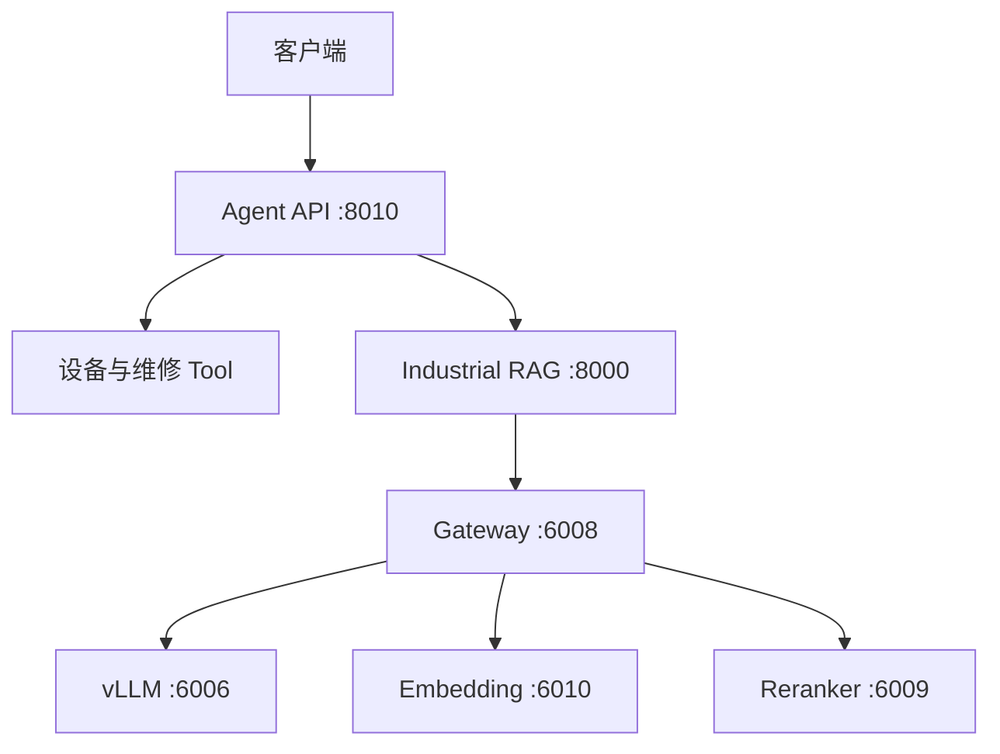

# Industrial Fault Diagnosis Agent

面向工业设备故障诊断场景的大模型应用工程。项目以 Siemens SINAMICS G120C 为示例，组合 LangGraph、可审计工具节点、Hybrid RAG、Reranker 和 FastAPI，实现设备状态查询、维修记录聚合、技术手册检索、风险分级与人工复核。

## 核心能力

- LangGraph 状态编排与条件路由
- 设备状态、维修历史和诊断报告工具节点
- BM25 + Vector + RRF 混合检索
- Reranker 失败自动降级
- 证据不足拒答与引用来源返回
- 温度、报警、历史异常和受控操作风险分级
- 高风险结果进入 Human Review，不执行停机、断电或 PLC 写入
- Request ID、健康检查、超时处理和结构化错误响应

## 系统结构



| 服务 | 默认端口 | 主要职责 |
|---|---:|---|
| vLLM | 6006 | Qwen3-8B 推理 |
| Gateway | 6008 | 统一模型访问与降级处理 |
| Reranker | 6009 | 检索结果重排 |
| Embedding | 6010 | BGE-M3 文本向量化 |
| Industrial RAG | 8000 | 文档、知识库、检索与问答 |
| Agent API | 8010 | Graph 编排、风险判断与诊断报告 |

## 项目目录

```text
agent/                 LangGraph Agent、Tool、Schema 和 FastAPI
gateway/               模型统一网关
embedding_service/     Embedding 独立服务
reranker_service/      Reranker 独立服务
industrial-rag/        Hybrid RAG 与知识库 API
deployment/            六服务启动、停止和健康检查
requirements/          分服务 Python 依赖
data/                  Agent 示例业务数据
tests/                 离线测试、质量测试和真实 E2E 测试
docs/                  架构、接口、部署和测试说明
```

## 快速开始

项目建议使用 Linux、Python 3.10、Conda 和 NVIDIA GPU。模型服务分别运行在独立环境中，详细安装命令见 [部署说明](docs/deployment.md)。

```bash
git clone https://github.com/woddenduck/industrial-fault-diagnosis-agent.git
cd industrial-fault-diagnosis-agent

cp .env.example .env
# 编辑 .env，确认 Conda 环境、模型、路径和知识库 ID

bash deployment/start_all.sh --validate
bash deployment/start_all.sh
bash deployment/health_check.sh
```

停止全部服务：

```bash
bash deployment/stop_all.sh
```

## 调用 Agent

```bash
curl -sS -X POST http://127.0.0.1:8010/v1/diagnose \
  -H "Content-Type: application/json" \
  -H "X-Request-ID: demo-001" \
  -d '{
    "query": "请综合诊断 DEVICE-001 当前运行状态，并判断是否存在过热风险。",
    "device_id": "DEVICE-001",
    "device_model": "G120C",
    "knowledge_base_id": "你的真实知识库ID",
    "create_report": true
  }'
```

接口详情见 [API 说明](docs/api.md)，首次上传文档和构建知识库的方法也在其中说明。

## 测试

完整离线测试（默认不会访问真实服务）：

```bash
python -m pytest
```

离线封装验收：

```bash
python tests/test_stage8_packaging.py
python tests/test_stage8_repository.py
```

诊断质量验收：

```bash
python tests/test_diagnosis_quality.py
```

真实服务启动后执行 HTTP E2E：

```bash
set -a
source .env
set +a
python tests/test_agent_http_e2e.py
```

更多测试方式见 [测试说明](docs/testing.md)。

## 数据与模型

GitHub 仓库不包含模型权重、PDF 手册、Embedding、BM25 索引或 ChromaDB 数据。首次部署时需要自行下载模型，并通过 RAG API 上传合法文档、构建知识库。

## 安全边界

Agent 只提供诊断和排查建议，不自动执行停机、断电、PLC 写入或保护参数修改。高风险与严重风险结果会进入人工复核流程。

## 文档

- [系统架构](docs/architecture.md)
- [部署说明](docs/deployment.md)
- [API 说明](docs/api.md)
- [测试说明](docs/testing.md)
