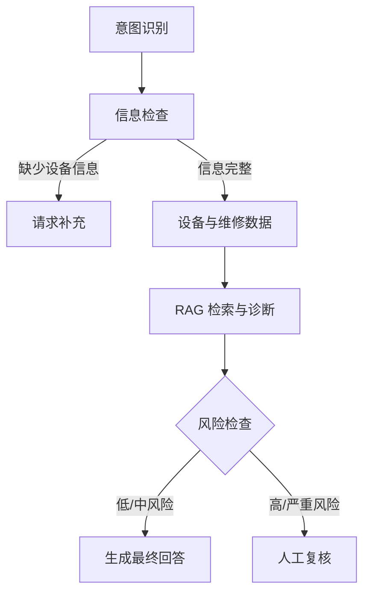

# 系统架构

## 1. 设计目标

项目将“设备实时数据、维修记录、技术手册证据和安全控制”组合成一条可追踪的诊断链路。LLM 负责基于证据生成解释，不直接控制工业设备。

## 2. 服务边界

| 组件 | 输入 | 输出 |
|---|---|---|
| Agent API | 用户查询、设备和知识库信息 | 诊断、风险等级、来源和执行轨迹 |
| Tool | 设备编号 | 设备状态、维修记录或诊断报告 |
| Industrial RAG | 问题、型号和知识库 ID | 回答、证据判断和来源 |
| Gateway | 标准化模型请求 | LLM、Embedding 或 Reranker 响应 |
| 模型服务 | 文本或候选文档 | 生成文本、向量或重排分数 |

## 3. Agent Graph



核心状态由 `agent/state.py` 管理，节点位于 `agent/nodes.py`，图结构位于 `agent/graph.py`，HTTP 入口位于 `agent/api.py`。

## 4. RAG 链路

```text
Query Rewrite
→ BM25 + Vector 召回
→ RRF 融合
→ Reranker 或 Fallback
→ 上下文构建
→ 证据充分性判断
→ LLM 回答或拒答
```

Reranker 不可用时允许降级；LLM 或 Embedding 不可用时，必要链路不能完成，健康检查会报告异常。

## 5. 安全设计

- 设备状态优先于技术手册中的通用危险警告。
- 缺少温度等关键数据时返回 `unknown`，不猜测风险。
- 高风险和严重风险必须人工复核。
- Agent 不执行控制型操作。
- 每次请求返回 Request ID 和节点执行轨迹，便于排查。
