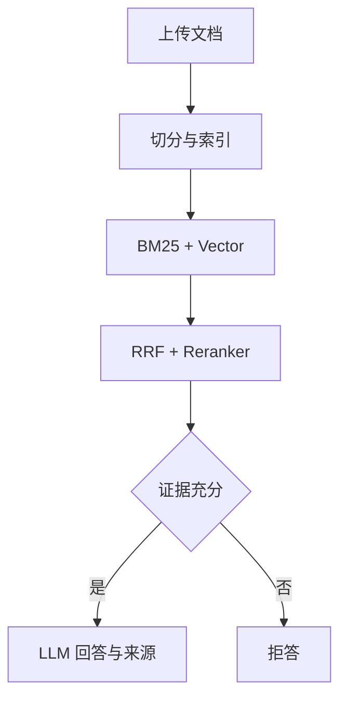

# Industrial RAG

`industrial-rag/` 是工业故障诊断项目的知识库与问答子系统。它负责文档上传、知识库构建、Hybrid Retrieval、证据门禁和基于上下文的回答；统一启动、服务依赖和正式部署配置由仓库根目录管理。

## 处理链路



Reranker 不可用时允许按配置降级；Embedding、向量库或必要的生成服务不可用时，健康检查会报告异常。

## 目录职责

```text
app/
  main.py                 FastAPI 路由与健康检查
  schemas.py              HTTP 请求/响应契约
  services/               文档、建库、检索和问答服务
common/
  paths.py                跨机器运行目录解析与校验
config/                   RAG 配置模板
rag/                      切分、召回、融合、重排和上下文构建
tests/                    RAG 模块测试、评测与故障注入
```

运行生成的 `data/`、`logs/`、上传文档和向量数据库不会提交到 GitHub。

## 启动

不要在该子目录维护另一套依赖或启动脚本。回到仓库根目录，使用统一配置和部署入口：

```bash
cp .env.example .env
# 编辑 .env 中的模型路径、Conda 环境和服务端口

bash deployment/start_all.sh --validate
bash deployment/start_all.sh
bash deployment/health_check.sh
```

只安装 RAG 服务依赖时使用：

```bash
python -m pip install -r requirements/rag.txt
```

默认地址为 `http://127.0.0.1:8000`。

## API

| 方法 | 路径 | 作用 |
|---|---|---|
| `GET` | `/health` | 检查 Gateway、LLM、Embedding、Reranker 和向量库 |
| `GET` | `/models` | 返回当前模型配置 |
| `POST` | `/documents/upload` | 上传并登记文档，返回 `document_id` |
| `POST` | `/knowledge-bases` | 根据文档创建知识库，返回 `knowledge_base_id` |
| `POST` | `/chat` | 检索、证据判断并生成回答或拒答 |

完整请求字段和示例见仓库根目录的 [`docs/api.md`](../docs/api.md)。

## 建库顺序

1. 启动六项服务并确认健康检查通过；
2. 调用 `/documents/upload` 获得一个或多个 `document_id`；
3. 调用 `/knowledge-bases`，传入设备型号和文档 ID；
4. 将返回的 `knowledge_base_id` 写入本机 `.env`；
5. 通过 `/chat` 或 Agent `/v1/diagnose` 验证真实链路。

公开仓库不包含 G120C PDF、已建向量库或可直接使用的知识库 ID。

## 测试

RAG 子系统保留的测试用于模块回归、故障注入和检索质量评测。它们不属于根目录默认离线 CI 的自动收集范围；运行前请安装 `requirements/rag.txt`，并根据测试性质准备临时数据或真实服务。

Agent 与六服务真实链路的权威验收入口是：

```bash
python -m pytest -m e2e tests/test_agent_http_e2e.py -s
```

测试分层和数据边界见 [`docs/testing.md`](../docs/testing.md)。

## 安全与边界

- 上传文件名只使用 basename，避免目录穿越；
- 知识库不存在或证据不足时返回明确业务状态；
- RAG 只提供证据与回答，不下发 PLC 或设备控制指令；
- 模型输出仍需结合设备实时状态和授权工程师判断。
